# Schema — rate-sheet-v2

Generated from `prisma/schema.prisma`. Renders inline on GitHub, Cursor, VS Code, and any Mermaid-aware previewer.

## Entity-relationship diagram

```mermaid
erDiagram
    %% --- Org / Accounts ---
    Org ||--o{ ClientAccount : "owns"
    Org ||--o{ Technician    : "employs"

    %% --- Rate-sheet masters (shared across accounts) ---
    RateSubCategory ||--o{ AccountRate : "type-of"
    Sla             ||--o{ AccountRate : "covers"

    %% --- Per-account rate sheet ---
    ClientAccount ||--o{ AccountRate       : "rate rows"
    ClientAccount ||--o{ MiscFee           : "misc fees"
    ClientAccount ||--o{ Assignment        : "tech assigned to"
    ClientAccount ||--o{ InvoiceRun        : "invoice history"
    ClientAccount ||--o{ UserAccountAccess : "SDM scope"

    %% --- Workforce ---
    Technician ||--o{ Assignment     : "works under"
    Assignment ||--o{ TimesheetEntry : "logs hours"

    %% --- Identity / scoping ---
    User ||--o{ UserAccountAccess : "scoped to"
    User ||--o{ TimesheetEntry    : "entered by"
    User ||--o{ InvoiceRun        : "generated by"

    %% --- NextAuth adapter (Phase 3) ---
    User ||--o{ Account : "OAuth links"
    User ||--o{ Session : "active sessions"

    Org {
        cuid     id            PK
        string   name          UK "HCL, Cognizant, TCS, …"
        enum     outputTemplate "FSO | PRE_INVOICE"
        string   defaultCurrency "USD"
    }

    ClientAccount {
        cuid    id        PK
        cuid    orgId     FK
        string  name         "Acadia, ZF, JLL, EverSource, …"
        string  currency  "nullable; defaults to org"
    }

    Sla {
        cuid    id        PK
        string  code      UK "NBD / SBD / 2BD / 3BD / 9X5X4 / 24X7X4 / SCHEDULE / NA"
        string  label
        int     sortOrder
    }

    RateSubCategory {
        cuid     id                PK
        enum     rateCategory      "DEDICATED | PROJECT_TM | DISPATCH_SCHED"
        string   code              "FIRST_HOUR, FULL_DAY, ANNUAL_BACKFILL, …"
        string   label
        int      sortOrder
        bool     isOvertimeVariant "true for OT/weekend rows"
    }

    AccountRate {
        cuid     id                PK
        cuid     clientAccountId   FK
        cuid     rateSubCategoryId FK
        int      band              "0..4"
        cuid     slaId             FK
        decimal  rateAmount        "12,4  -- nullable, manual entry"
        date     effectiveFrom
        date     effectiveTo       "nullable = open-ended"
        string   notes
    }

    MiscFee {
        cuid    id              PK
        cuid    clientAccountId FK
        enum    kind            "MISCELLANEOUS_PRICES / RETAINER_FEES / MILEAGE / BGV_COST / PER_DIEM / TOOLKIT / ACCOUNT_SPECIFIC / OTHER"
        string  label
        decimal amount          "nullable, manual entry"
        string  notes
    }

    Technician {
        cuid    id              PK
        cuid    employerOrgId   FK
        string  firstName
        string  lastName
        enum    primaryCategory "RateCategory"
        int     band            "0..4"
        bool    active
    }

    Assignment {
        cuid    id              PK
        cuid    technicianId    FK
        cuid    clientAccountId FK
        enum    rateCategory    "RateCategory"
        date    startDate
        date    endDate         "nullable = open-ended"
    }

    TimesheetEntry {
        cuid    id           PK
        cuid    assignmentId FK
        date    date
        decimal hours        "6,2"
        cuid    enteredById  FK
    }

    InvoiceRun {
        cuid    id              PK
        cuid    clientAccountId FK
        int     periodYear
        int     periodMonth
        enum    format          "FSO | PRE_INVOICE"
        string  fileUrl
        cuid    generatedById   FK
        datetime generatedAt
    }

    User {
        cuid   id    PK
        string email UK
        string name
        enum   role  "ADMIN | SDM"
    }

    UserAccountAccess {
        cuid id              PK
        cuid userId          FK
        cuid clientAccountId FK
        datetime grantedAt
    }

    Account {
        cuid   id                PK
        cuid   userId            FK
        string provider
        string providerAccountId
    }

    Session {
        cuid     id           PK
        cuid     userId       FK
        string   sessionToken UK
        datetime expires
    }
```



## How the rate sheet flows at a glance

```
       master tables             per-account rate sheet                 inheritance
       (shared)                  (filled by admin)                      (at assignment time)
       --------                  -----------------                      -------------------

       RateSubCategory ─────┐                                     ┌── Technician.band
       (FIRST_HOUR,         │                                     │   (e.g. 2)
        FULL_DAY,           │                                     │
        ANNUAL_BACKFILL …)  │                                     │
                            ▼                                     ▼
       Sla  ─────────►   AccountRate (account × subCat × band × sla)  ◄── filter
       (NBD, SBD,        rateAmount nullable                         (category +
        SCHEDULE, NA)     effective window                            tech.band +
                                                                      effective today)
                            │
                            ▼
                         shown in the new-assignment form
                         as the rates THIS technician inherits
```

## Constraints worth knowing

- **`assignment_dedicated_single_active`** — partial unique index:
  `UNIQUE ("technicianId") WHERE "endDate" IS NULL AND "rateCategory" = 'DEDICATED'`.
  At most one open-ended DEDICATED assignment per technician.
- **`account_rates_clientAccountId_rateSubCategoryId_band_slaId_effectiveFrom_key`** —
  unique row per `(account, sub-category, band, SLA, effective-from)`.
- **`client_accounts_orgId_name_key`** — accounts unique within an org.
- **`technicians_primaryCategory_band_idx`** — speeds up
  "find me all Band 2 PROJECT_TM techs."
- All FKs from `AccountRate` / `MiscFee` to `ClientAccount` cascade on delete.
  `RateSubCategory` and `Sla` deletes are RESTRICTed (master rows can't disappear
  while in use).
